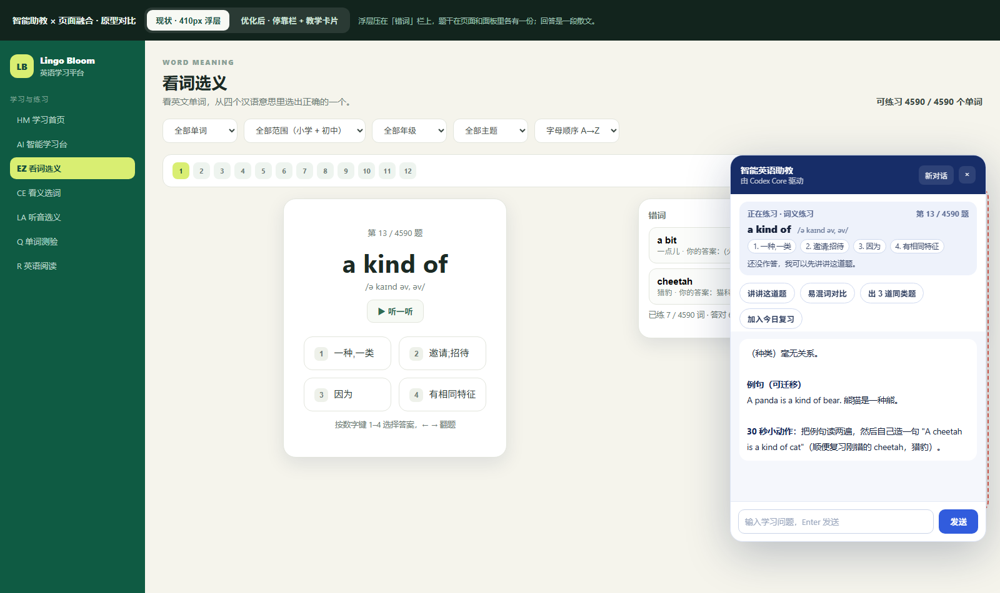
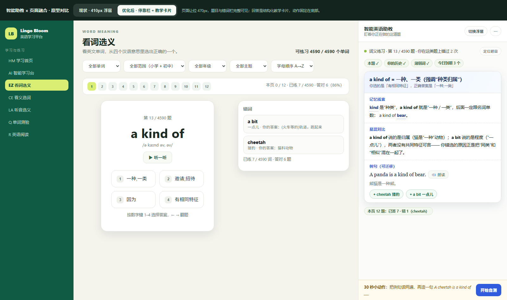

# 智能助教 × 页面融合：体验诊断与优化方案

> 状态：**已实施**（§2 的 P0-1…P2-5 全部落地；逐条落点与证据见 `docs/agent-ux-verification.md` §19，线上测试与复跑命令见 §18/§20）
> 日期：2026-10-06
> 输入证据：`attachments/image.png`（看词选义页实测截图）
> 关联代码：`web/agent.css`、`web/js/components/AgentAssistant.js`、`web/js/learningContext.js`、`web/js/markdown.js`、`web/js/main.js`、`internal/learning/agent.go`、`internal/learning/agent_context.go`、`internal/learning/agent_stream.go`
> 配套原型：`docs/agent-panel-prototype.html`（可直接双击打开对比"现状 / 优化后"）

---

## 0. 结论（先看这一段）

问题**不在提示词**。`docs/agent-page-integration.md` 里规划的 P0/P1/P2 大部分已经落地了：
上下文总线 + 服务端富化（`buildAgentSnapshot` / `renderAgentSnapshot`）、场景化教学指令（`agentSceneGuides`）、
结构化动作（出同类题 / 加入今日复习）、SSE 流式输出，代码里都在。体验仍然"很差"，是三件工程层面的事：

| # | 根因 | 一句话 | 关键证据 |
|---|---|---|---|
| 1 | **结合**：助教是"浮层"不是"页面的一部分" | 410px 固定浮层压在页面主区右侧，页面不给它让位，题目信息在页面和面板里各存一份 | `web/agent.css` 的 `.agent-panel{position:fixed;right:22px;bottom:82px;width:min(410px,…);height:min(620px,…);z-index:61}`；`.app-content>main{width:calc(100% - var(--page-gutter)*2)}` |
| 2 | **感知**：读到的东西"不可见、不完整、不结构化" | 服务端确实富化了上下文，但① 学生看不到助教读了什么，② 只覆盖 4 类页面，③ 只到"当前这一题"，缺本页全景 | 服务端返回 `AgentChatResponse.Snapshot`，前端 `AgentAssistant.js` 全文无 `snapshot` 引用；`publishContext` 只出现在 Meaning/Quiz/Reading/Mistakes 四个组件 |
| 3 | **展示**："一段散文"塞进"一根窄柱" | 回答无结构约束、面板过窄、流式时每帧钉到底部，学生读完停在文末 | `agentCommonRules` 只要求"350 字以内 + 结尾一个小动作"；`.`agent-panel` 宽 410px；`scrollMessages()` 在 `appendDelta` 里每次都 `scrollTop = scrollHeight` |

**最高性价比的三个动作（P0，约 2–3 人日）**：① 面板支持"停靠"、页面让位；② 讲解就地出现在题目下方，而不是把人拽到右下角小窗；③ 回答改成"结构化教学卡片"（结论 / 线索 / 例句带朗读 / 30 秒自测 / 生词入册），而不是散文。

---

## 1. 现状实测（截图逐条）

以下每条都能在 `attachments/image.png` 上指到位置，或在代码里指到行。

### 1.1 面板压住页面右侧内容

- 截图：右侧"错词"卡片里的文字 `a bit 一点儿·你的答案：(火车等的)轨道，跑…` 在 x≈1477 处被面板左缘截断，后半句压在面板下面；面板同时盖住了页面主区的右端。
- 代码：面板一直是 `position:fixed`，页面没有任何"让位"规则（`agent.css` 全文只有浮动一种形态），主区却铺满到右缘（`.app-content>main{width:calc(100% - var(--page-gutter)*2)}`）。
- 影响：视口越窄越严重（1366/1440 的笔记本上题目卡右缘和整条错词栏都会被盖住），而这恰恰是最常见的学习场景。

### 1.2 面板把题干又抄了一遍

- 截图：面板顶部固定占用约 1/4 高度，重复显示 `a kind of /ə kaɪnd əv/`、四个选项、"还没作答，我可以先讲讲这道题。"
- 代码：`AgentAssistant.js` 的 `contextCard` computed 把 `spelling/phonetic/options/verdict` 全渲染一遍。
- 影响：学生刚从左边看过这四行，右边再看一遍；垂直空间被吃掉，真正有价值的内容（记忆线索、易混词区别）反而要滚动才看得到。

### 1.3 回答是一段散文，没有"教学结构"

- 截图：整条回答是一坨文本：`（种类）毫无关系。` / `例句（可迁移）` / `A panda is a kind of bear. 熊猫是一种熊。` / `30 秒小动作：把例句读两遍…`。所谓的"小标题"是模型自己加的粗体，不是 UI 结构。
- 代码：`agentCommonRules`（`agent_context.go:735`）只约束了字数与"结尾一个小动作"，没有要求输出结构；前端只能靠 `renderMarkdown` 渲染。

### 1.4 窄栏 + 每帧钉底，读完停在文末

- 代码：`AgentAssistant.js` 的 `appendDelta` 每收到一个 SSE chunk 就调 `scrollMessages()` → `scrollTop = box.scrollHeight`。
- 效果：300+ 字的回答流式输出完毕后，视口停在**最后一行**（截图正好看到结尾"30 秒小动作…"），开头必须手动往上翻；410px 宽的中文一屏只够 2–3 个短句。

### 1.5 答案里的英文是"死"的

- 项目里已经有 `web/js/speech.js`（浏览器语音合成）和 `add-review` 动作，但助教面板一个都没用上：
  - 例句不能点读（学生要复制到别处去读）；
  - 回答里提到的生词（如截图里的 `cheetah`）不能一键入册；
  - 生成中不能停止（全文没有 `AbortController`），也没有"重试 / 复制 / 朗读整段"。

### 1.6 "助教读到了什么"不可见

- 服务端 `runAgentWith` 会回填 `out.Snapshot`（含本题历史、掌握度、薄弱词、到期复习数），前端拿到后**完全没有渲染**。
- 后果：学生无法判断"它到底知不知道我错过这个词"，出问题时（上下文丢了）也看不出来——这是**感知类故障无法自查**的典型症状。

### 1.7 感知覆盖面只有 4/12 类页面

`publishContext` 只在 `MeaningPracticeView`、`QuizView`、`ReadingView`、`MistakesView` 出现。
同步训练（Tongbu）、我的作业（Homework）、课程学习（Course）、变式练习（Drill）这些页面打开助教，顶部显示的是
"打开任意练习页，我会自动看到你正在做的题目。"——**学生在同步训练页正在做题，助教却说没有题目**，这是感知失败最直观的一幕。

### 1.8 模块引入不一致（潜在静默故障）

`learningContext.js` 被两种说明符引用：
- `main.js` / `AgentAssistant.js` / `QuizView.js` → `?v=20261004-practice-source-r1`
- `MeaningPracticeView.js` → `?v=20261004-agent-stream-r3`

文件里用 `globalThis['__lingoBloomLearningStore']` 兜底成单例，所以现在**不会**丢上下文；
但两个 URL 会各自执行一遍模块顶层代码，缓存版本号还可能不一致（同一份 JS，不同入口拿到不同修订）。
这类问题不会报错，只会表现成"偶发地，面板看不见当前题"。

---

## 2. 优化措施

### 2.1 结合（Integration）：从"浮层抽屉"到"可停靠的教练栏"

**P0-1 停靠模式（Dock）**
- 措施：面板增加两种形态——`float`（现状，小屏/临时）和 `dock`（右侧固定栏，页面让出宽度并重排）。切换按钮放在面板头部，选择记入 `localStorage`。
- 落点：
  - `web/agent.css`：新增 `.agent-dock{--agent-rail:420px}`，用 `.agent-dock .app-content>main{margin-right:calc(var(--agent-rail) + var(--page-gutter))}` 让内容区 reflow；面板本体改为 `position:sticky/absolute` 贴在栏内。
  - `web/js/main.js`：在根节点上挂 `:class="{'agent-dock': assistant.placement==='dock' && assistant.open}"`。
  - `AgentAssistant.js`：新增 `placement` 状态与切换按钮。
- 验收：停靠时题目卡、选项、错词栏**无任何像素被遮挡**；窗口从 1024px 拖到 2560px 不错位；切页保持形态。

**P0-2 页内就地回答卡（inline coach card）**
- 措施：答错后的"不懂，讲讲"、题卡下方的"出同类题"，**在题目卡下方就地展开一张回答卡**，而不是把用户拽到右下角小窗；卡片里带"继续追问"把上下文送进侧栏面板。
- 落点：`MeaningPracticeView` / `QuizView` 的 `meaning-ask` / `quiz-ask` 区域（`MeaningPracticeView.js:841`）改成"内联回答卡 + 追问入口"，复用同一个 `/api/agent/chat/stream`。
- 验收：答错后点"不懂，讲讲"，讲解出现在题目下方、不遮挡选项；原地可"加入复习 / 出同类题"；不需要移动视线到屏幕右下角。

**P0-3 阅读页选词浮条**
- 措施：`ReadingView` 选中单词/短语 → 选区上方浮出 `朗读 / 讲解 / 入册` 三个按钮（现在只有整段的"逐句解析"，选词没有入口）。
- 落点：`ReadingView.js` 增加 selection 监听 + 浮条组件；复用 `askAssistant('', {quickAction:'explain-sentence'})` 与 `speech.js`。
- 验收：任意段落选中一个词能在原地看到释义与朗读，无需打开面板。

**P1-4 去掉重复的题干卡，改成"状态胶囊"**
- 措施：面板顶部不再复述题干与选项，改为一行状态：`词义练习 · 第 13 / 4590 题 · 你在这词错过 2 次`，点击可让页面上那道题 `scrollIntoView` 并高亮 2 秒。
- 收益：把 1/4 的面板高度还给内容，同时强化"助教盯着的是**这道题**"的心理连接。

### 2.2 感知（Perception）：让"看到了"变成可核对、全覆盖、有纵深

**P1-1 快照回执（snapshot receipt）**
- 措施：把服务端已返回的 `snapshot` 渲染成一行可展开的"助教已读"标签：`本题 ✓　你的历史 ✓　薄弱词 ✓　今日到期 3 个`；展开可见 `renderAgentSnapshot` 的原文。
- 落点：`agent.go` 在响应里补一个 `snapshotText` 字段（函数已有，只需透出）；`AgentAssistant.js` 渲染成 chips。
- 验收：任何一次回答，学生都能点开看到助教实际读到的数据；上下文丢失时立刻可辨。

**P1-2 补齐页面覆盖面（4 → 10 类）**
- 措施：为 `tongbu`（同步训练）、`homework`（我的作业）、`course`（课程学习）、`drill`（变式练习）、`exam`（考试）、`grammar`（语法专题）补 `publishContext` 与对应 `agentSceneGuides`。
- 验收：同步训练页打开助教，面板显示"同步训练 · Starter Unit 1 · 第 4 题"，"讲讲这道题"能引用该题题干与学生作答；变式练习页能说明"这 3 道题是助教刚生成的"。

**P1-3 加入"本页全景"**
- 措施：`context` 增加 `pageMap`（当前页 12 题的 `{wordId, correct}`），服务端折叠成一句事实："本页 12 题已答 7、错 1（cheetah）"。
- 收益：截图里"顺便复习刚错的 cheetah"是模型自己推断出来的；改成结构化输入后，这句变成**可核对的事实**，也才有资格写进 `KnowledgeMastery.reason`。

**P1-4 统一模块引入 + 上下文过期**
- 措施：`learningContext.js` 的 import 说明符统一（建议全站去掉 `?v=`，改由构建/部署层做缓存失效）；`contextForRequest()` 增加"超过 5 分钟未更新则视为过期"。
- 验收：`grep -r "learningContext.js" web/js` 只出现一种写法；长时间挂着页面再提问，不会把半小时前的旧题当"当前题"。

**P1-5 前端—服务端上下文契约守门**
- 措施：`scripts/ci.ps1` 增加一个 node 脚本，扫描所有 `publishContext({...})` 的键与服务端 `agentContextString/Int/Bool/Strings` 读取的键做差集，不一致就失败。
- 收益：防止"页面上了报、服务端不认"或用错的键名静默丢字段。

### 2.3 展示（Presentation）：从"一坨文字"到"教学卡片"

**P2-1 结构化输出协议（本项目已有现成管道）**
- 措施：让模型返回 JSON 而不是散文，沿用内容工厂的 `structureFactoryContent` / `extractJSONObject` / 校验 管道：

```json
{
  "headline": "a kind of = 一种（强调“种类归属”）",
  "points": [
    {"label": "记忆线索", "text": "kind 是“种类”，a kind of 就是“一种/一类”，后接名词单数。"},
    {"label": "易混对比", "text": "a bit 表示“一点儿”，与种类无关；a kind of 后面一定跟名词。"}
  ],
  "example": {"en": "A panda is a kind of bear.", "zh": "熊猫是一种熊。"},
  "check": {"prompt": "试着造一句：A cheetah is a kind of ___.", "answer": "cat"},
  "words": [{"word": "cheetah", "meaning": "猎豹"}]
}
```

- 前端渲染成固定卡片：**结论条 → 要点（带色条）→ 例句（🔊 朗读）→ 30 秒自测（可点开答案）→ 生词 chips（可入册）**。
- 降级：JSON 解析失败时回落到现有 `renderMarkdown`，保证不白屏。
- 验收：同一道题的讲解在 410px 宽下**不需要横向滚动**，首屏就能看到结论、例句和自测动作。

**P2-2 答案里的英语变成可交互**
- 措施：渲染后把英文词/短语包成 `<button class="agent-word">`；点击调 `speech.js` 朗读；命中词库的词挂"加入今日复习"（复用现有 `add-review` action）。
- 验收：例句可逐词点读；回答里出现的生词能一键入册，`/api/progress` 与"今日复习"可见。

**P2-3 流式体验**
- 措施：① 新回答开始时**钉住回答卡顶部**而不是底部（流式结束后学生从头读）；② 加"停止生成"（`AbortController` + `reader.cancel()`）；③ 首字前显示骨架"正在分析这道题…"；④ 完成后可"重试 / 复制 / 朗读整段"，并显示 `durationMs`。
- 验收：发一条长问题，从第一个字开始就在视口内；中途可停止；停止后不留半截状态。

**P2-4 版式**
- 措施：面板宽度 410 → 420~480px 且可拖拽调宽；`line-height:1.75`；例句用衬线/加大字号、译文弱化配色；"30 秒小动作"做成**底部 sticky 行动条**，不随长文滚走。
- 验收：410px 下一行能放 20+ 汉字；关键动作永远在视口底部可见。

**P2-5 小屏**
- 措施：`@media(max-width:900px)` 面板改为全屏抽屉（现在 `width:min(410px,calc(100vw - 24px))` 在手机上会盖住整页）。

---

## 3. 分期与验收

| 阶段 | 动作 | 验收标准（可自动化/可截图） | 估算 |
|---|---|---|---|
| **P0** | 2.1 全部 + 2.3 的 P2-1/P2-3 | 停靠后**无遮挡**；讲解就地出现；讲解首屏含结论+例句+自测；长问题可停止 | 2–3 人日 |
| **P1** | 2.2 全部 + 2.3 的 P2-2 | 覆盖 10 类页面；"助教已读"可展开；例句可点读、生词可入册；契约守门进 CI | 2–3 人日 |
| **P2** | 2.3 的 P2-4/P2-5 + 主动触发下沉 | 小屏全屏抽屉；长回答折叠；归因结论写进 `KnowledgeMastery.reason` 并在学习画像可查 | 3–5 人日 |

---

## 4. 配套原型

`docs/agent-panel-prototype.html`（独立静态页，无需起服务，双击浏览器打开即可；加 `?mode=dock` / `?mode=current` 可指定初始形态）：

- 左：仿"看词选义"页（题目卡 + 错词栏），右：助教栏；
- 顶部开关可切换 **现状（浮层，410px，压在内容上）** 与 **优化后（停靠，页面让位，结构化教学卡片）**；
- 卡片里的 🔊 会真的调用浏览器语音合成，生词 chip 可点击（原型内只做视觉反馈）。

**现状（410px 浮层）**：错词栏被压住（"跑起来"后面被截断），题干在页面和面板里各出现一次，回答是一段散文。



**优化后（停靠栏 + 教学卡片）**：页面让位 470px，错词栏完整可见；回答变成"结论 / 记忆线索 / 易混对比 / 例句（可朗读）/ 生词入册"的结构化卡片，"30 秒小动作"固定在栏底不随长文滚走。



---

## 5. 风险与取舍

| 风险 | 说明 | 对策 |
|---|---|---|
| 结构化输出增加时延/token | JSON 比散文略长 | 只对"讲解类"回答启用；其余场景（归因、小结）保留文本；命中缓存直接返回 |
| 停靠模式要适配所有页面布局 | 管理后台是另一套骨架 | 只在学习态（`workspaceMode==='learn'`）默认停靠，后台默认浮动 |
| 主动提示可能打断答题 | 已有 5 分钟冷却与"不弹窗"原则 | 保持现状，只把主动提示的入口统一到侧栏，不新增弹窗 |
| 模型编造 | 已有"以题库为准"的规则 | 结构化输出后做一致性校验：`headline/points` 里出现的释义与 `snapshot.Current.Meaning` 冲突则不展示 |

---

## 6. 未决问题（需要拍板）

1. 默认形态用**停靠**还是**浮动**？（我建议：宽屏默认停靠，窄屏默认浮动）
2. 讲解是否一律走 JSON 结构化？还是只对"讲讲这道题 / 为什么选错"两个意图启用？
3. 页内回答卡与侧栏面板的关系：回答卡只保留"结论 + 例句 + 动作"，长讲解去侧栏——是否接受这种拆分？
4. P0 是否本周就做？如果只做一件，我建议做 **2.1 的 P0-1（停靠）**，因为它同时解决"遮挡"和"视线来回跳"。
