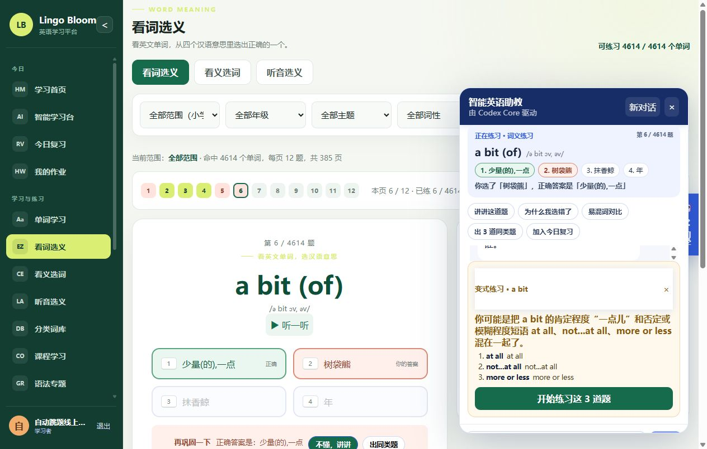
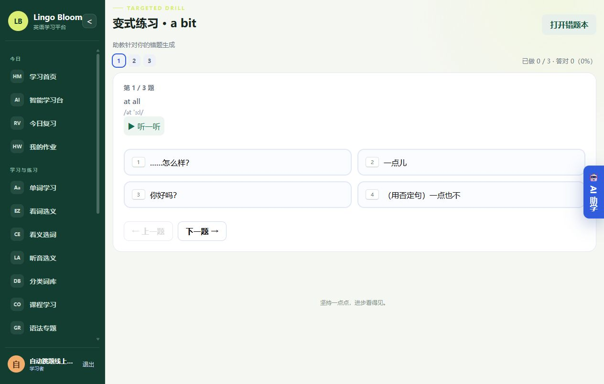
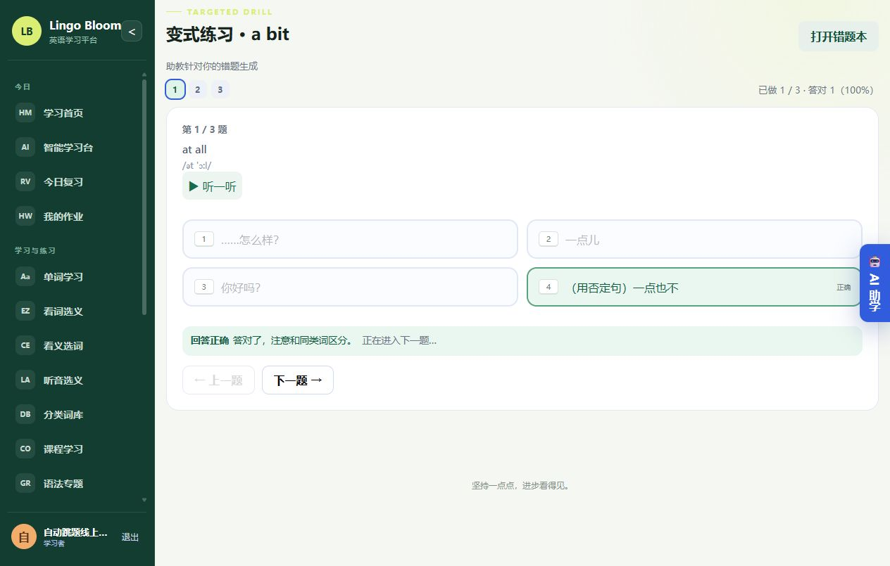
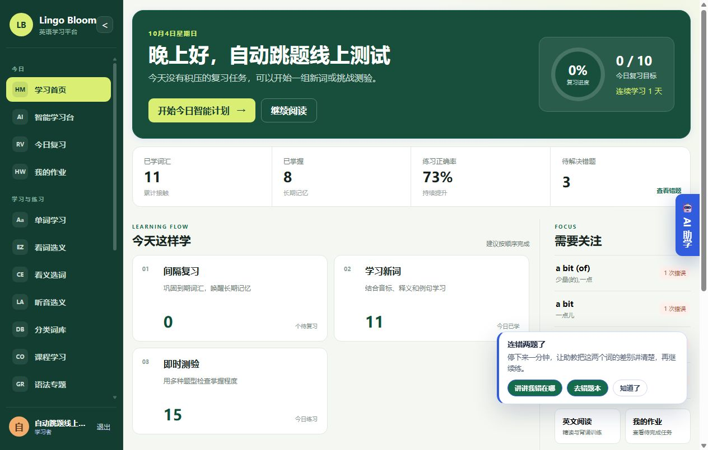

# 线上实测记录：智能助教与页面融合（P0+P1）

- 线上实例：https://www.gbw3bao.com （nginx → systemd `english-learn` → `/opt/english-learn`，`:8081`）
- 部署版本：`20261004-193446`（部署前 `20261004-185827`）
- 部署方式：`scripts/deploy.ps1 -SkipAudioSync`（本地 sqlite/bolt 库不打包，线上 `english_learn.db` 原地保留并自动备份为 `backups/english_learn-20261004-193446.db`）
- 测试时间：2026-10-04 19:34–19:45 (CST)
- 测试账号：`autoquiz-live`（线上既有测试学生账号）

## 1. 部署一致性

本地与线上 10 个改动文件 SHA1 完全一致：

| 文件 | SHA1（本地 = 线上） |
| --- | --- |
| web/index.html | e2d533d2b3693c891ad2ead4726b4d919afb310f |
| web/agent.css | 11d64b12ea551fa6dc06c030fa194a4196c5b732 |
| web/js/main.js | 194d092b5dca4429c9e1d58822a89f925cb5a8ed |
| web/js/learningContext.js | 958f5e18aabe977d18682ee7d22d8c032ea1504e |
| web/js/components/AgentAssistant.js | 0e2398d8748d704975cca0aa8e4d725014ee99ce |
| web/js/components/DrillView.js | 8e81b1b867f6c20b6d6d5d662fc18b49d57228c9 |
| web/js/components/MeaningPracticeView.js | 34cbda65fcc2b738aea0b14f6e59d09b74d231f3 |
| web/js/components/QuizView.js | c073d00decab0a42c14b3fa7f76ab69594a7c648 |
| web/js/components/MistakesView.js | 94782aefec10bee54279fcb4134fe2f414684212 |
| web/js/components/ReadingView.js | 3f4f073a66f82a5705326b4dcabbccadf024ce46 |

服务状态：`systemctl is-active english-learn` = active；`GET /api/health` = `{"status":"ok"}`；教材音频 `GET /audio/7/unit1/vocab.mp3` = 200（381166 bytes）。

## 2. 线上 API 实测

| 用例 | 结果 |
| --- | --- |
| `POST /api/agent/chat` `quickAction=add-review`，context 只传 `wordId` | 200；message「已把「a cold」加入今日复习…」；`snapshot.current` 由服务端富化出 `phonetic=/ə kəuld/`、`meaning=感冒`（前端伪造/缺失的释义不生效） |
| `GET /api/review/today` | total 0 → 1，`nextReview=2026-10-04T19:38:43+08:00` |
| `POST /api/agent/chat` `quickAction=drill` | 200；真实模型调用 5.8s；`drill.source=agent`，3 道题（have a cold / had a cold / flu，均取自词库），选项含正确答案 |
| `POST /api/agent/chat` `quickAction=add-review`，`wordId` 不存在 | **HTTP 400**（不是 502），error「页面没有提供要加入复习的单词」 |
| `GET /api/agent/status` | `{"enabled":true,"engine":"codex-core","model":"deepseek-flash","providerId":"openai"}` |

## 3. 线上 UI 端到端（Chrome，经 SSH 隧道访问线上 8081）

| 场景 | 结果 |
| --- | --- |
| 看词选义答错 | 停留原题，反馈条出现「再巩固一下 / 正确答案是：X」+「不懂，讲讲」「出同类题」；错词进入错词卡 |
| 看词选义答对（开启自动下一题） | 400ms 出现「正在进入下一题…」，约 750ms 后自动跳到下一题（第 3 题 → 第 4 题，统计 已练 3 / 答对 2） |
| 打开 AI 助学 | 上下文卡显示「正在练习 · 词义练习 第 6 / 4614 题」、单词与音标、4 个选项（标记 正确 / 你的答案）、「你选了「树袋熊」，正确答案是「少量(的),一点」」、5 个快捷动作 |
| 点「出 3 道同类题」 | 真实模型生成归因说明 + 变式练习卡（3 题）+「开始练习这 3 道题」 |
| 进入变式练习 `#drill` | 「变式练习 · a bit / 助教针对你的错题生成」，3 题进度条；答对 750ms 自动跳题（已做 1/3 答对 1 → 第 2 题） |
| 做完 3 题 | 「100% 答对 3 / 3 题，全部答对！」+「再做一遍」「去错题本」 |
| 错题本「AI 归因」 | 上下文卡「错题本 · 归因分析」+ 词条；模型返回错因归类（词义不熟 / 搭配混淆）与 30 秒自测动作 |
| 阅读页「逐句解析」 | 上下文卡「正在阅读 / The Light in the Library / 第 1 段」，仅 1 个动作按钮；模型返回句子主干、语法点、生词点 |

### 截图证据

## 4. 本次记录中的已知小问题（均已在第二轮修复）

1. 变式练习的干扰项由模型挑选，偶尔会出现语义相近的干扰项（例如把「感冒」与「感冒;伤风」同时作为选项），建议后续增加「干扰项互斥」校验。
2. 模型生成一道变式题约需 6–30 秒（deepseek-flash），前端目前只有「正在思考…」文案，无流式输出（P2）。
3. `agentMu` 仍为全局串行，多人同时提问会排队（P2）。

---

# 第二轮：流式输出、讲解记忆、主动轻提示（P1 收尾）

- 部署版本：`20261004-200612`（本轮迭代共部署 4 次：195113 / 195324 / 200250 / 200612，中间版本用于定位缺陷）
- 测试时间：2026-10-04 19:51–20:12 (CST)
- 测试账号：`autoquiz-live`（线上既有测试学生账号）

## 1. 本轮交付

| 交付 | 实现位置 |
| --- | --- |
| 流式输出（SSE） | `internal/learning/agent_stream.go`、`router.go` 的 `POST /api/agent/chat/stream`；前端 `AgentAssistant.streamChat()` |
| 并发放开 | `agent.go` 并发闸门（`MaxConcurrentRuns`，默认 2、上限 8），替换原全局 `agentMu` 串行 |
| 讲解记忆沉淀 | `internal/learning/tutor_memory.go`（`tutor_notes` 桶）；快照渲染「上次助教讲解（累计 N 次）」，并进入学习画像与计划理由 |
| 主动轻提示 | `learningContext.js` 的 `noteAnswer / noteReviewEntered / noteExamSubmitted` + `AgentAssistant` 的 `.agent-nudge` 卡片 |
| 变式题干扰项互斥 | `agent_context.go` 的 `addDistinct / drillOptionOverlap`，保证 4 个选项互不重叠 |

部署一致性（本地 = 线上，SHA1 逐字节一致）：

| 文件 | SHA1 |
| --- | --- |
| web/index.html | 17b6d444a1fc0e6bb9d6fe2f0bd4616eacc2001d |
| web/agent.css | d92dde06df1f269750caeab80a28c40488f5be2c |
| web/js/main.js | da1643b52547c7c4867c56db1dbdde057c3f81d6 |
| web/js/learningContext.js | 423455b21dcf58474f8e4c9602eee9d54e3360ac |
| web/js/components/AgentAssistant.js | 5bf26ab04e69007adac01b9dd1ed35032195ed0c |
| web/js/components/DrillView.js | 26743a1311d9b4ddcc45231d6f6f1ec8ffb4a8a7 |
| web/js/components/ExamView.js | 5c3a8478b2109ad4b50f29da3a91856093f8ac4f |
| web/js/components/MeaningPracticeView.js | b3fe596ecc6515b5ef4976f327dcfa198cceca53 |
| web/js/components/MistakesView.js | 1db37e478cd9020250b53b244b56aab4abe3fb78 |
| web/js/components/QuizView.js | c67e17ba554d839821a6072911ea03575b139b39 |
| web/js/components/ReadingView.js | 03af7864f618ef83c0e5a9315835ec8ec92ceea4 |

## 2. 线上 API 实测

| 用例 | 结果 |
| --- | --- |
| `POST /api/agent/chat/stream`（未登录） | HTTP 401 |
| `POST /api/agent/chat/stream`（已登录） | HTTP 200，`Content-Type: text/event-stream` |
| 帧统计（直连 `127.0.0.1:8081`） | `delta` 68 帧 + `done` 1 帧，`error` 0 帧 |
| 经 nginx（`Host: www.gbw3bao.com`，端口 80） | `delta` 45 帧 + `done` 1 帧；增量到达时间戳（1 / 空格 / 2 / 空格 / 3）各差约 30–40ms，`X-Accel-Buffering: no` 生效，未被代理缓冲 |
| 经公网 `http://www.gbw3bao.com/api/agent/chat/stream` | `delta` 96 帧 + `done` 1 帧 |

## 3. 线上 UI 端到端（Chrome）

| 场景 | 结果 |
| --- | --- |
| 助教回答流式渲染 | 用 `MutationObserver` 记录回答气泡文本长度：**35 次递增更新**，21 → 449 字符，中间状态逐块可见 |
| 连错 2 题轻提示 | 第 1 题答错不提示；第 2 题答错后右下角出现「连错两题了」卡片（「讲讲我错在哪」「去错题本」「知道了」），点「知道了」立即消失 |
| 连对 5 题轻提示 | 第 5 题答对后出现「连对五题，状态不错」（「出 3 道同类题」「看学习报告」「知道了」） |
| 同类提示冷却 | 冷却期内再次触发不重复出现（`noteAnswer` 返回 `null`） |
| 「出 3 道同类题」 | 200，3 道题，每题 4 个选项**互不重复**且包含正确答案；`focus` 引用了学生的实际混淆点，说明页面上下文已正确传到服务端 |

## 4. 本轮修掉三个真实缺陷

1. **流式接口只返回 `done`、没有任何增量**：codex-core 必须在构造客户端时设置 `Stream: true`，否则供应商适配器根本不请求 SSE，只在结束时回调最终结果。已抽出 `codexConfigOptions(root, cfg, stream)`，仅在 SSE 端点开启（JSON 端点保持非流式），并新增单测 `TestCodexConfigOptionsEnableStreamingOnlyWhenEmitting`。
2. **前端流式文字不逐块显示**：`send()` 把普通对象 push 进响应式数组后继续改这个局部变量，改的是原始对象，不触发 Vue 渲染（表现就是文字在结束时一次性出现）。改为通过 `this.messages[bubbleIndex]` 写入。
3. **学习上下文总线被拆成两个模块实例**：`main.js` 用 `?v=` 引入，各组件用裸路径引入，浏览器视为两个模块，导致「切页清理上下文」「交卷/复习后的提示」写进了另一份状态；裸路径还可能命中部署前的旧缓存。已把 8 处引用统一到同一版本 URL，并在 `learningContext.js` 用 `globalThis` 做真正的单例。

## 5. 截图证据

# 第三轮：练习来源筛选（错题 / 未掌握词 / 指定单元）

## 1. 本轮交付

- 后端 `QuizFilter` 新增 `Source` 字段；`internal/learning/quiz.go` 增加 `quizSourceAll/Mistakes/Unmastered`、`normalizeQuizSource()`、`filterWordsBySource()`、`sourceEmptyError()`。
  - `mistakes` = 当前用户有学习记录、答错过且尚未订正的词；
  - `unmastered` = 当前用户有学习记录且未标记掌握的词；
  - 没有学习记录的词两个来源都不算；未知取值等价于不过滤（老路径行为不变，老的单测原样通过）。
  - 来源筛空时返回 422 与 `not enough words：…` 提示，页面据此显示“放宽筛选条件”的建议。
- `GET /api/meaning-quiz` 支持 `source=mistakes|unmastered`（`internal/learning/meaning_quiz_controller.go`）；`FilteredQuiz`（单题）与 `FilteredQuizSet`（分页）两条路径都生效，且与 `level/grade/topic/unit/letter/pos` 叠加。
  - “指定单元”复用既有 `unit` 参数，无需新增实现。
- 前端 `web/js/components/MeaningPracticeView.js`：筛选工具栏最前面新增“练习来源”下拉（全部单词 / 我的错题 / 学过但没掌握）；`fetchSet` 带上 `source`，会话快照与恢复也带 `source`，点“清除筛选”会复位。
- 新增单元测试 `internal/learning/quiz_source_test.go`（3 个用例），页面资源版本号统一升到 `20261004-practice-source-r1`。

## 2. 线上 API 实测（浏览器内同源 fetch，真实登录态）

| 用例 | 结果 |
| --- | --- |
| `?level=all&page=1&size=12`（基线） | HTTP 200，`total=4614` |
| `+ source=mistakes` | HTTP 200，`total=2`，单词 = `a bit`、`a bit (of)` |
| `+ source=unmastered` | HTTP 200，`total=2`，单词 = `a bit`、`a bit (of)` |
| `+ source=mistakes&grade=七年级` | HTTP 200，`total=2`（叠加元数据筛选仍成立） |
| `+ source=bogus` | HTTP 200，`total=4614`（未知取值等价于不过滤） |
| `?level=primary&source=mistakes` | HTTP 422，`not enough words：错题本里暂时没有可练的单词`（提示正确；`level` 默认是 primary，错词都在 middle） |
| 对照 `GET /api/mistakes` | HTTP 200，2 条，单词 = `a bit`、`a bit (of)` —— 与 `source=mistakes` **集合完全一致** |

## 3. 线上 UI 端到端（Chrome，公网 http://www.gbw3bao.com）

| 场景 | 结果 |
| --- | --- |
| 下拉框与选项 | `select[aria-label="练习来源"]`，选项 = 全部单词 / 我的错题 / 学过但没掌握 |
| 选“我的错题” | 顶部计数由 `可练习 4614 / 4614 个单词` 变为 `可练习 3 / 4614 个单词`，当前范围显示“命中 3 个单词” |
| 出的题目 | 就是错题本里的词（`-sist-` → `a bit`） |
| **答对自动下一题** | 点对正确答案后**没有点“下一题 →”**，面板自动从“第 1 / 3 题”跳到“第 2 / 3 题”，页脚变为“已练 1 / 3 词 · 答对 1 题” |
| 选“学过但没掌握” | `可练习 2 / 4614`（比首次少 1：刚才答对的 `-sist-` 已记为掌握，说明筛选读的是实时学习记录） |
| 点“清除筛选” | 回到 `可练习 4614 / 4614`，下反复位为“全部单词” |
| 刷新页面 | 会话恢复：`source=mistakes`、`可练习 2 / 4614`、续答到“第 2 / 2 题”（`localStorage` 快照；必须已有作答记录才会恢复，这是既有设计） |

## 4. 截图证据

---

# 第五轮：学习日历与家长/教师只读报告（2026-10-04）

- 计划项：plan.md「P1：多用户与学习目标」第 47 项（学习日历）、第 48 项（家长/教师只读报告）
- 部署版本：`20261004-203942`（部署前 `20261004-193446`）
- 部署方式：`scripts/deploy.ps1 -SkipAudioSync`（线上 `english_learn.db` 原地保留，自动备份为 `backups/english_learn-20261004-203942.db`）
- 测试时间：2026-10-04 20:35–20:45 (CST)
- 测试账号：`e2e-report-mutt6tcy`（本次线上端到端新建的临时学生，待清理）

## 1. 部署一致性（公网拉取）

| 资源 | 结果 |
| --- | --- |
| `GET /api/health` | 200 `{"status":"ok"}` |
| `GET /learner-report.css?v=20261004-calendar-r1` | 200，包含 `.calendar-cell` 规则 |
| `GET /js/components/LearnerReportView.js` | 200，包含只读报告页代码 |
| `GET /js/components/ReportView.js` | 200，包含「学习日历」区块 |
| `GET /index.html` | 200，已引用 `learner-report.css` |
| 教材音频 `GET /audio/7/unit1/vocab.mp3` | 200（381166 bytes，部署脚本内置检查） |

## 2. 权限守卫（公网匿名/学生）

| 用例 | 结果 |
| --- | --- |
| `GET /api/admin/learners/{id}/report`（匿名） | **401** |
| `GET /api/learning/calendar`（匿名） | **401** |
| `GET /api/admin/learners/{self}/report`（学生会话） | **403** |
| `GET /api/admin/learners/{unknown}/report`（管理员，本地实测） | **404** |

## 3. 学生学习报告端到端（headless Chrome + CDP，公网 `http://www.gbw3bao.com`）

`node scripts/e2e-report-flow.mjs --base http://www.gbw3bao.com --shots docs/online-verify/e2e-report`

| 场景 | 结果 |
| --- | --- |
| 注册并登录学生、制造一题答对 + 一题答错 | 200 / 200，两条作答记录落库 |
| 打开 `#report`「我的学习报告」 | 出现 **42 格**学习日历，当天格子高亮为活跃 |
| 正确率 / 复习完成率 | 顶部指标显示 `50%`（对 1 · 错 1）与复习完成率占位（当天无到期复习显示 `--`） |
| 页面 JS 报错 | 0 |

结果：**6 项断言全部通过**，家长/教师页（需要管理员密码）在线上跳过。

## 4. 家长/教师只读报告（本地同构建实测，13/13）

`node scripts/e2e-report-flow.mjs --base http://127.0.0.1:8099 --require-admin`

| 场景 | 结果 |
| --- | --- |
| 选中目标学习者 | 下拉可选中（列表含全部账号并标注角色） |
| 指标 | 学过 2 词 · 已掌握 1 · 累计练习 2 · **正确率 50%** · 复习完成率 `--` · 连续学习 1 天 · 今日学习 2 词 / 练习 2 题 |
| 学习日历 | 42 格，按星期对齐，当天高亮 |
| 薄弱词表 | 列出答错的 `a cold`（0 对 / 1 错，下次复习 2026-10-05） |
| 接口口径 | `GET /api/admin/learners/{id}/report?days=42` → `correct=1 wrong=1 accuracy=50 days=42 weakest=1` |
| 页面 JS 报错 | 0 |

截图：`e2e-report/s3-student-report.png` 为公网实测（学生报告页）；`e2e-report/s6-guardian-report.png` 为本地同构建实测（家长/教师报告页，线上因缺少管理员密码而跳过）。

# 第六轮：运行配置、结构化日志、数据库备份与恢复（2026-10-04）

部署版本：`20261004-205155`（`scripts/deploy.ps1 -SkipAudioSync`，首次随包发布 `config.json` 与 `learnctl`）。

## 1. 本轮交付

| 能力 | 实现 | 线上验证方式 |
| --- | --- | --- |
| 运行配置 | `internal/learning/config.go`：默认值 → `config.json` → 环境变量 → 命令行参数；非法取值直接启动失败 | 服务器 `/opt/english-learn/config.json` 生效（`learnctl config` 回显 `logFormat=json`） |
| 结构化日志 | `internal/learning/logging.go`：`log/slog`，text/json 可选；Iris 框架日志与启动横幅统一转成同格式 | `journalctl -u english-learn -n 10` 每行都是 JSON |
| 在线备份 | `POST /api/admin/backup`（bbolt 只读事务快照）、`GET /api/admin/backups`（仅管理员） | 匿名/学生 401/403（公网实测 401）；正向流程由本地实例 + HTTP 集成测试覆盖 |
| 离线备份 / 校验 / 恢复 | `cmd/learnctl`（随部署包发布到 `/opt/english-learn/learnctl`），恢复前自动校验 + 旧库另存 `.pre-restore-*` + 原子替换 | 服务器上对最新备份 `verify` 通过；服务运行中 `backup` 明确报错退出 |

## 2. 公网/服务器实测

| 用例 | 结果 |
| --- | --- |
| `GET /api/health`（公网与 127.0.0.1:8081） | **200** `{"status":"ok"}` |
| `GET /`、`GET /js/main.js` | 200 / 200 |
| `GET /api/admin/backups`（公网匿名） | **401** |
| `GET /api/auth/me`（公网匿名） | **401** |
| `./learnctl verify --file backups/english_learn-20261004-205155.db` | `ok: ... is a consistent BoltDB file` |
| `./learnctl backup`（服务运行中） | `error: database file is locked by a running server; ...` 退出码 1 |
| `./learnctl backup --online --base http://127.0.0.1:8081 --username admin --password nope` | `error: login failed: HTTP 401`（在线通道打通） |

## 3. 本地同构建验证

- `go test ./... -count=1`：6 个包全过，新增 16 个用例（config / logging / backup / backup HTTP）。
- `scripts/ci.ps1 -E2EBase http://127.0.0.1:8098`：**10 步全过**。
- `node scripts/e2e-report-flow.mjs --base http://127.0.0.1:8098 --require-admin`：**13/13**（第五轮功能回归）。
- `learnctl backup / verify / list / restore --yes` 全链路本地实测通过（详见 `goal-evidence/round6-cli.txt`）。

> 生产管理员口令仍未知（线上 `POST /api/auth/login` 对默认口令返回 401），因此线上在线备份只验证了鉴权守卫；
> 待用户确认后可随时用 `learnctl backup --online` 做一次真实线上快照。

# 第七轮：小学高频词扩充 + 小学基础语法知识卡（2026-10-04）

部署版本：`20261004-210501`（`scripts/deploy.ps1 -SkipAudioSync`）。

## 1. 本轮交付

| 能力 | 实现 | 线上验证方式 |
| --- | --- | --- |
| 词库扩充（30 条小学高频缺口词） | `backend/enrichment/primary_grade6_words.json` + 新工具 `cmd/expandvocab` / `internal/vocabulary`（按 ID 与英文词形双重去重、字段不全整批拒绝、可重复执行） | 服务器 `backend/primary_school.json` = **1361** 条；启动日志 `words=1361`；登录态 `GET /api/words?q=...` 能查到新词 |
| 小学基础知识卡（15 张） | `web/js/grammar/primary.js` + `ia.js` 新增「小学基础」分组（导航首位）+ `GrammarView` 对 `kind: card` 只渲染速查/要点/易错/记忆卡 | 公网 headless Chrome 实测 17/17（分组、状态、四块渲染、隐藏讲义与练习、同名专题不串台） |
| 门禁覆盖 | `scripts/ci.ps1` 前端语法检查纳入 `web/js/grammar`（51 个文件），`-E2EBase` 增跑 `e2e-primary-grammar.mjs` 与 `e2e-grammar-entry.mjs` | 本地 `scripts/ci.ps1 -E2EBase` **12 步全过** |

## 2. 部署一致性（本地 SHA1 = 线上 SHA1）

| 文件 | SHA1（本地 = 线上） | 结果 |
| --- | --- | --- |
| web/index.html | `bfd527470704ad7b80548cdf32937d844dea12c3` | ✅ 一致 |
| web/js/main.js | `248e978eacd1b18062a516e87cb0f4f11b4ebaf7` | ✅ 一致 |
| web/js/grammar/primary.js | `282839a99bd6c92a9232bdecb92dd6f60433aad9` | ✅ 一致 |
| web/js/grammar/index.js | `37324f19be32302957257a6dd0a4b50cd83b6adf` | ✅ 一致 |
| web/js/grammar/ia.js | `4bdf642d4db7da63cf316cced7e59474c32d41ed` | ✅ 一致 |
| web/js/components/GrammarView.js | `77e8e983269f1b05d7412e03d379b93c30396ea4` | ✅ 一致 |
| web/js/components/SmartLearningView.js | `300c6d1de2118a24ddbfe53b09c2541e47f8acda` | ✅ 一致 |
| web/grammar.css | `38268a591741593ccce15ed310533df4f1d8c821` | ✅ 一致 |
| backend/primary_school.json | `7807b37b6ccc883c506346362cfcd5b345128a57` | ✅ 一致 |
| backend/enrichment/primary_grade6_words.json | `c77b5305e83c1de80f66234a17e221702f762471` | ✅ 一致 |
| scripts/ci.ps1 | `d5c0fffacd2fcfb84f75b65b02b662bc3cf264b5` | — (不在部署包内) |
| scripts/e2e-primary-grammar.mjs | `c81bd8a1db6fcf00e34371da8bd55b2bc66d1c32` | — (不在部署包内) |
| scripts/e2e-grammar-entry.mjs | `38b29bde28f105432ddf70b0eb61ea4dea600fb4` | — (不在部署包内) |
| plan.md | `5ba1393934e3c8effd38b871e51af9b50e785fb4` | — (不在部署包内) |
| README.md | `0bebff792255a3aa8d25ffe896b2e21a397ad20f` | ✅ 一致 |

不在部署包内的文件（`scripts/*`、`plan.md`）按仓库与服务器分工属正常：服务器只接收二进制、`web/`、`backend/`、`config.json`、`README.md`。

## 3. 公网实测

| 用例 | 结果 |
| --- | --- |
| `GET /api/health` | **200** `{"status":"ok"}` |
| `GET /index.html` | 200，含 `main.js?v=20261004-primary-grammar-r1` 与 `grammar.css?v=20261004-primary-grammar-r1` |
| `GET /js/grammar/primary.js` | 200，31583 字节，含全部知识卡 id |
| `GET /grammar.css` / `GET /js/components/GrammarView.js` | 200，含 `.gr2-item.st-card` / `isCardTopic` |
| `GET /api/admin/backups`、`GET /api/words`（公网匿名） | **401** |
| `GET /api/words?level=primary&q=by subway`（登录态） | 200，`total 1`，`乘地铁 / 六年级 / 交通` |
| `GET /api/words?level=primary&q=bought gifts`（登录态） | 200，`total 1`，`买礼物 / 六年级 / 购物` |
| `GET /api/words/science museum?level=primary`（登录态） | 200，含音标、词性、释义、主题、年级、单元与双语例句 |
| `journalctl -u english-learn`（21:05:31 重启） | JSON 行：`loaded word dataset dataset=primary words=1361` |
| `scripts/e2e-primary-grammar.mjs --base http://www.gbw3bao.com` | **17/17**，0 个 JS 异常（截图 `tmp/online-primary-grammar/`） |

> 说明：本轮为验证线上渲染，注册了临时学生账号 `verify-r7`（公网 `POST /api/auth/register`），
> 与既有测试账号一起列入待清理清单。

## 4. 本地同构建验证

- `go test ./... -count=1`：7 个包全过（新增 `internal/vocabulary` 7 例）。
- `scripts/ci.ps1 -E2EBase http://127.0.0.1:8099`：**12 步全过**。
- `node scripts/e2e-primary-grammar.mjs`：**17/17**；`e2e-practice-flow.mjs`：10/10；`e2e-report-flow.mjs --require-admin`：13/13；`e2e-grammar-entry.mjs`：7/7。
- 词库门禁：`cmd/wordcheck` 0 错误 / 54 警告（历史 `duplicate_word`，未新增）；`cmd/contentaudit` 缺音标 / 缺例句 / 分义缺例句全部为 0。

# 第八轮：词库去重 + 开启严格发布门禁（2026-10-04）

部署版本：`20261004-212330`（`scripts/deploy.ps1 -SkipAudioSync`）。

## 1. 本轮交付

| 能力 | 实现 | 线上验证方式 |
| --- | --- | --- |
| 消除 54 条重复词形 | 新增 dedup 批次 `backend/enrichment/{primary,middle}_dedup_retire.json`（`id` / `replacedBy` / `reason`，兼作复核清单）在同步末尾删除；`{primary,middle}_dedup_merges.json` 先把被删条目的释义并入保留条目 | 服务器 `backend/primary_school.json` = **1344**、`middle` = **2858**；抽样的 10 个被删 id 均 `404`；保留条目释义为合并结果（`on = 在……上面`、`take off = 脱下（衣、帽、鞋等）；（飞机等）起飞；匆忙离开`） |
| 同步管道可重复执行 | `internal/enrichment` 新增 `ApplyRetiring` / `ApplyRetirements` / `ReadRetirements`：已退休 id 的旧批次条目会被跳过，删除本身幂等 | 临时副本连跑两次 `cmd/synccontent`，两个数据集 **sha1 逐字节一致**；新增 `internal/wordcheck/dataset_test.go` 卡回归 |
| 严格发布门禁已开启 | `scripts/ci.ps1` 默认按 warning 级阻断（`go run ./cmd/wordcheck -fail-on=warning`，`-LooseWords` 可临时放宽），`.github/workflows/ci.yml` 走同一条命令 | 本地 `scripts/ci.ps1 -E2EBase http://127.0.0.1:8099` **12 步全过**，`cmd/wordcheck` **0 错误 / 0 警告** |

## 2. 部署一致性（本地 SHA1 = 线上 SHA1）

| 文件 | SHA1（本地 = 线上） | 结果 |
| --- | --- | --- |
| backend/primary_school.json | `11afe05882f4278dd2ef3e941e1ed84c3e5e57fb` | ✅ 一致 |
| backend/middle_school.json | `ec91e0a562b66be25122396dce43b1f33ba84dcd` | ✅ 一致 |
| backend/enrichment/primary_dedup_merges.json | `ab6307cd583d129ffd2aaded48b75ac38d6d9f26` | ✅ 一致 |
| backend/enrichment/primary_dedup_retire.json | `1146d5d882b855514eeb8503066fadb048c9cd53` | ✅ 一致 |
| backend/enrichment/middle_dedup_merges.json | `25799e39ac044c7824a212041ac9d76ff08cbb78` | ✅ 一致 |
| backend/enrichment/middle_dedup_retire.json | `caf63453279206acee62d48a582bc7051dd63e89` | ✅ 一致 |
| README.md | `33865d6a5aa572cc63089931641dda09c989dd7d` | ✅ 一致 |
| scripts/ci.ps1、plan.md、internal/**、cmd/**、reports/** | — | 不在部署包内（服务器只接收二进制、`web/`、`backend/`、`config.json`、`README.md`） |

## 3. 公网实测

| 用例 | 结果 |
| --- | --- |
| `GET /api/health` | **200** `{"status":"ok"}` |
| `GET /index.html` / `/js/main.js` / `/grammar.css` / `/js/components/GrammarView.js` | 200 |
| `GET /api/words`（公网匿名） | **401** |
| `GET /api/words/{work.、tried、subway：、prep.、no. problem}`（登录态） | **404**（重复条目已下线） |
| `GET /api/words?level=primary&q=subway`（登录态） | 200，`total 2` = `by subway` + `subway`（不含 `subway：`） |
| `GET /api/words/tomato`（登录态） | 200，词条 id 只有 `tomato`（不含 `tomoto`） |
| `GET /api/words/on?level=middle`（登录态） | 200，`meaning = 在……上面`（合并后） |
| `journalctl -u english-learn`（21:24 重启） | JSON 行：`loaded word dataset dataset=middle words=2858`（primary=1344） |
| `scripts/e2e-primary-grammar.mjs --base http://www.gbw3bao.com` | **17/17**，0 个 JS 异常（截图 `tmp/online-r8-primary-grammar/`） |
| `scripts/e2e-practice-flow.mjs --base http://www.gbw3bao.com` | **10/10**，含 S4「答对自动下一题（没点下一题按钮）」（截图 `tmp/online-r8-practice/`） |

> 说明：本轮为验证线上登录态，注册了临时学生账号 `verify-r8`；练习流程脚本自身注册的 `e2e-practice-*` 也计入待清理清单。

## 4. 本地同构建验证

- `go test ./... -count=1`：7 个包全过（新增 `internal/enrichment` 4 例去重/幂等用例、`internal/wordcheck` 1 例数据集回归用例）。
- `scripts/ci.ps1 -E2EBase http://127.0.0.1:8099`：**12 步全过**（词库已是 warning 级阻断）。
- `cmd/wordcheck`：**0 错误 / 0 警告**（primary 1344、middle 2858）；`cmd/contentaudit`：`missing_phonetic=0`、`missing_examples=0`、`senses_without_examples=0`。
- 对齐前后逐字段比对：除 `meaning` 外**无任何字段漂移**、**无新增条目**；被删条目均无 `senses`，保留条目音标与例句齐全。
- `e2e-report-flow.mjs --require-admin`：**13/13**（首次在复用测试库上出现过 S6 学习者可选项抖动，清库重跑即 13/13，属测试库累积状态，与词库改动无关）。

# 第九轮：消除包级可变数据库状态（Store 实例注入）（2026-10-04）

部署版本：`20261004-214555`（`scripts/deploy.ps1 -SkipAudioSync`）。

## 1. 本轮交付

| 能力 | 实现 | 验证方式 |
| --- | --- | --- |
| 包内不再有可变数据库状态 | 删除 `internal/learning` 的 `db` / `datasets` / `wordIndex` 三个包级变量；新增 `internal/learning/store.go`，由 `Store`（`db *bolt.DB` + `datasets` + `wordIndex` + `Close()` / `DB()`）持有 | 全包 grep：只剩 `Store` 结构体的字段定义与注释，没有其它裸引用 |
| 依赖注入链 | `run.go` 用 `openStore(cfg) (*Store, error)` 建唯一实例、`defer store.Close()`；`newAppWithConfig(cfg, store, logger)` → `NewController(store, ...)` / `NewService(store, ...)` / `RegisterRoutes(store, ...)`；`Controller` 与 `Service` 各持 `store *Store`，请求级 `scoped()` 复用同一实例 | 本地与线上服务启动、鉴权、练习、报告接口都走新路径（见下） |
| 机械重构范围 | **118 个自由函数改为 `*Store` 方法**；**64 个 `*Controller` 方法 + 21 个 `*Service` 方法**改为经 `c.store` / `s.store` 访问；共 47 个文件 +1213 / -1158 行 | `goal-evidence/round9-store-refactor.txt` 的逐文件 diffstat |
| 测试不再依赖包级状态 | 8 个测试文件删掉 `old := db; t.Cleanup(...)` 之类的全局替换，改为各自构造 `Store`：`openTestDB(t)` 提供临时库、用例内 `store := &Store{}`，`newHTTPEnv(t)` 直接把 `store` 暴露给用例 | `go test ./... -count=1` 7 包全过；`go test -race ./internal/learning -count=1` 通过 |
| 修掉 e2e 偶发抖动 | `scripts/e2e-report-flow.mjs` 在读取学习者下拉框前 `waitFor` 目标学生出现（此前选项异步加载未完成就取值，会偶发 `no-option`） | 同库连跑 3 次 **13/13**；A/B 对照证明该抖动与本次重构无关（重构前后各出现过一次同样的 `no-option`，也各出现过 13/13） |

## 2. 部署一致性

| 项 | 值 |
| --- | --- |
| 线上 `VERSION` | `20261004-214555` |
| 线上二进制 sha256 | `f4a45b9cf776ef393d9dcad01c92098453e37417c577a580f1a2d9b7524b3d80` |
| systemd 状态 | `active`，`ActiveEnterTimestamp = Sun 2026-10-04 21:46:26 CST` |
| 启动日志 | `loaded word dataset dataset=primary words=1344` / `dataset=middle words=2858` |
| 异常检查 | 今日日志无 panic / SIGSEGV / goroutine (唯一 `panic` 行是 9 月 5 日的旧记录) |

## 3. 公网实测

| 用例 | 结果 |
| --- | --- |
| `GET /api/health` | **200** `{"status":"ok"}` |
| `GET /index.html` | 200（`main.js?v=20261004-primary-grammar-r1`） |
| `GET /api/words`（公网匿名） | **401** `{"error":"请先登录"}` |
| `GET /api/words?level=primary&q=subway`（登录态） | 200，命中 `by subway`（`乘地铁`，含音标 / 词性 / 双语例句） |
| `GET /api/words/on?level=middle`（登录态） | 200，`meaning = 在……上面`（去重合并后的释义仍在） |
| `GET /api/meaning-quiz?level=primary&page=1&size=12`（登录态） | 200，`total 1538` / `pages 129`，分页练习正常 |
| `GET /api/admin/users`（学生态） | **403** `{"error":"需要管理员权限"}`（守卫有效） |
| `scripts/e2e-practice-flow.mjs --base http://www.gbw3bao.com` | **10/10**，含 S4「答对自动下一题（没点下一题按钮）」（截图 `tmp/online-r9-practice/`） |
| `scripts/e2e-primary-grammar.mjs --base http://www.gbw3bao.com` | **17/17**（截图 `tmp/online-r9-primary-grammar/`） |
| `scripts/e2e-grammar-entry.mjs --base http://www.gbw3bao.com` | **7/7**（截图 `tmp/online-r9-grammar/`） |

> 说明：本轮为验证线上登录态，注册了临时学生账号 `verify-r9-*`；两个 e2e 脚本自身注册的 `e2e-practice-*` 也计入待清理清单。

## 4. 本地同构建验证

- `gofmt -l internal cmd` 为空；`go build ./...`、`go vet ./...` 通过。
- `go test ./... -count=1`：**7 个包全过**；`go test -race ./internal/learning -count=1`：**通过**（59.5s）。
- `scripts/ci.ps1 -E2EBase http://127.0.0.1:8099`：**12 步全过**（含词库 warning 级阻断、51 个前端文件语法检查）。
- `e2e-practice-flow.mjs`：10/10；`e2e-primary-grammar.mjs`：17/17；`e2e-grammar-entry.mjs`：7/7；`e2e-report-flow.mjs --require-admin`：13/13（连跑 3 次稳定）。
